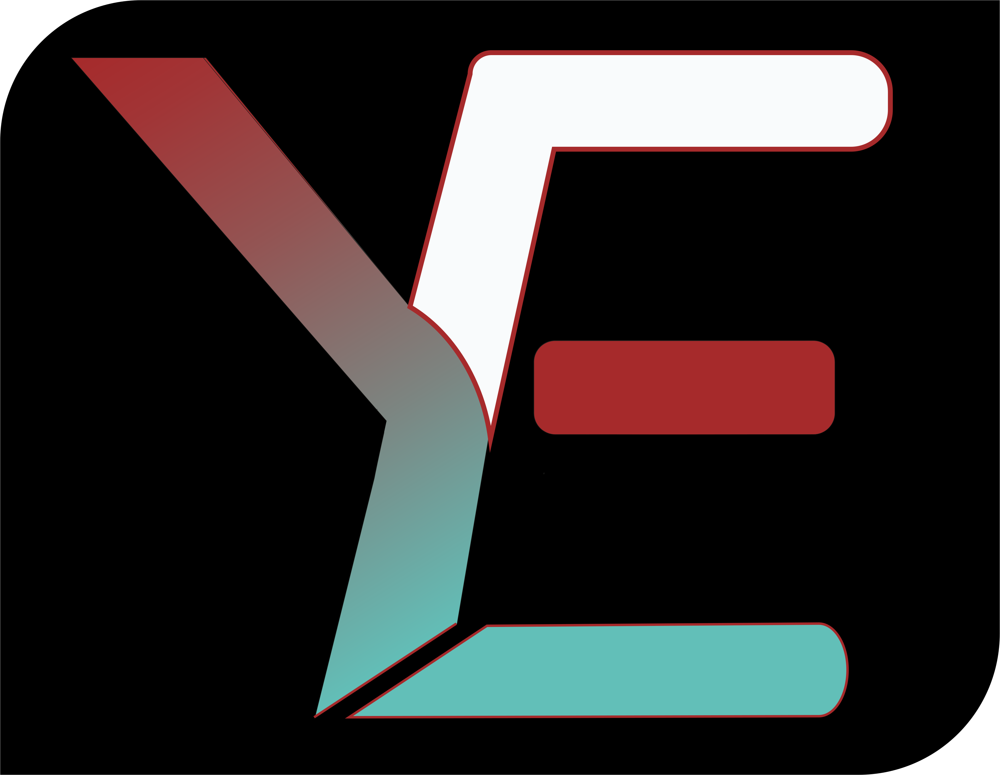

<h1 style="text-align: center; margin-top: 30px;">YourEdu</h1>

<h2 style="text-align: center;">Backend</h2>

### Introduction
This is the frontend of the YourEdu educational platform that seeks to bring all major stackholders together into bridging the gaps the exists in educational quality across our societies.

Explore the [app](https://bobdev.tech) or visit its [landing page](https://bobdev.tech/about) to learn more about it.

### Team

    
    Robert Amoah (<a href="https://www.linkedin.com/in/mr-robert-amoah">linkedIn</a>, <a href="https://x.com/Mr_robertamoah">X</a>) - Full stack developer 

### Technologies

- Vite (asset bundling)
- Vuejs 3 (frontend framework)
- Vue-router (navigation)
- Vuex (state management)

### Installation

- Clone repository
- cd into directory
- Install assets with npm or yarn

### Usage

This is the usage on your local system

<ul>
    <li>
        Run either of the following:
        <ul>
            <li>For npm: npm run</li>
            <li>For yarn: yarn</li>
        </ul>
    </li>
    <li>Visit the local development host provided by vite.</li>
</ul>
